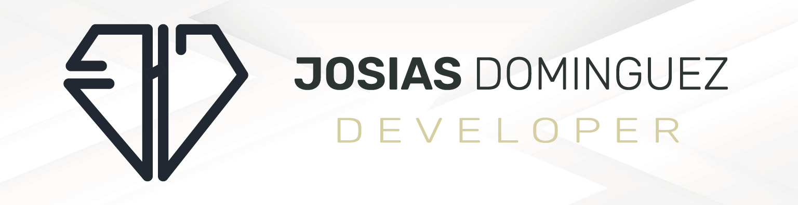

### Hello Codes💻 

#      

 
Hi, my name is Josias Dominguez Hernández! ! actually I'm software engineering student with experience in both residential and business projects. I love learning and staying up-to-date with the latest technologies and advancements in programming and design. As a developer, I focus on creating practical and innovative solutions to real-world problems. I'm always looking for new challenges and opportunities to grow and improve my skills.    

💻 Software Engineer Inter at [TecNeg](https://www.tec-neg.com/), [Theron](https://theron.com.mx/) 
✅ Proyects Cou-funder and Software Engineer [DevMentes](https://devmentes.com/) and [InternsMexico](#)  
📚 Studyng and experience in React, Laravel, React Native, Flutter, Java, and .NET, and others 
🐱‍💻 I have worked in Community Management, Graphic Design, Web Design, and Custom Software Development. And others 

### My skills:                       
 #### And More Skills

  <table>
    <tr>
      
    </tr>   
  </table>

